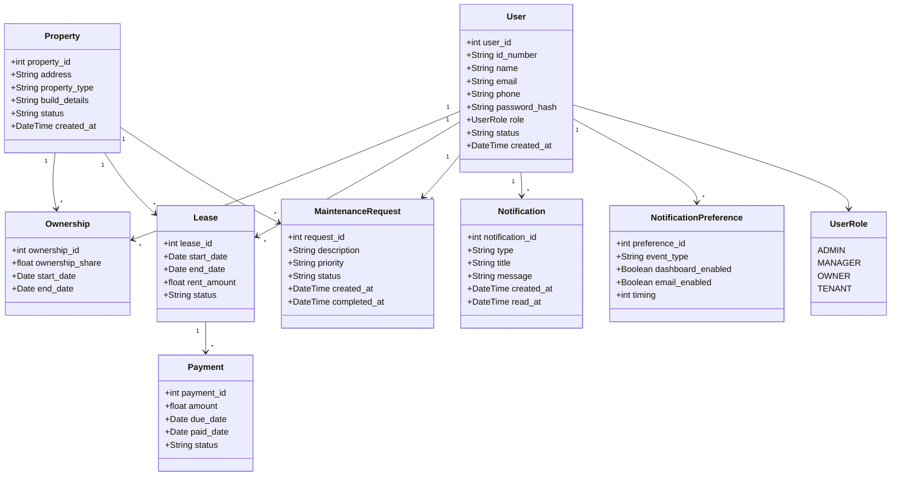

# UML Diagrams — Smart Property Management System

## 1. Class Diagram

```mermaid
classDiagram
    class User {
        +int user_id
        +String id_number
        +String name
        +String email
        +String phone
        +String password_hash
        +UserRole role
        +String status
        +DateTime created_at
    }

    class Property {
        +int property_id
        +String address
        +String property_type
        +String build_details
        +String status
        +DateTime created_at
    }

    class Ownership {
        +int ownership_id
        +float ownership_share
        +Date start_date
        +Date end_date
    }

    class Lease {
        +int lease_id
        +Date start_date
        +Date end_date
        +float rent_amount
        +String status
    }

    class Payment {
        +int payment_id
        +float amount
        +Date due_date
        +Date paid_date
        +String status
    }

    class MaintenanceRequest {
        +int request_id
        +String description
        +String priority
        +String status
        +DateTime created_at
        +DateTime completed_at
    }

    class Notification {
        +int notification_id
        +String type
        +String title
        +String message
        +DateTime created_at
        +DateTime read_at
    }

    class NotificationPreference {
        +int preference_id
        +String event_type
        +Boolean dashboard_enabled
        +Boolean email_enabled
        +int timing
    }

    class UserRole {
        ADMIN
        MANAGER
        OWNER
        TENANT
    }

    User "1" --> "*" Ownership
    Property "1" --> "*" Ownership
    User "1" --> "*" Lease
    Property "1" --> "*" Lease
    Lease "1" --> "*" Payment
    Property "1" --> "*" MaintenanceRequest
    User "1" --> "*" MaintenanceRequest
    User "1" --> "*" Notification
    User "1" --> "*" NotificationPreference
    User --> UserRole
```